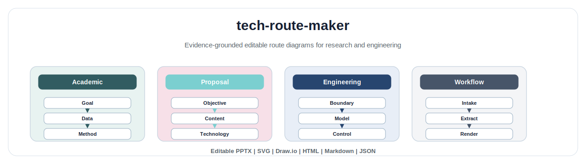
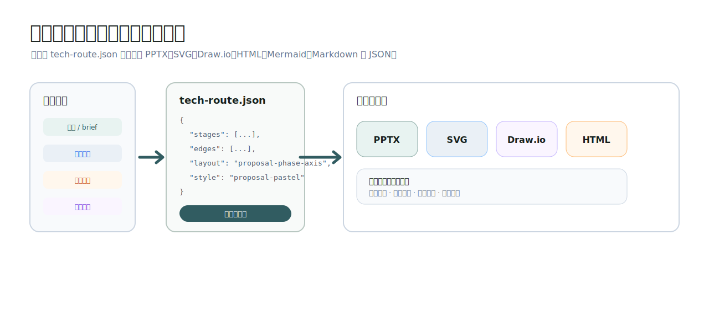
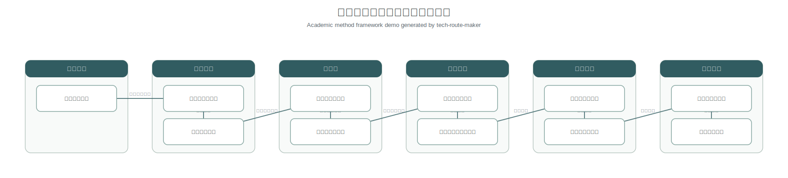
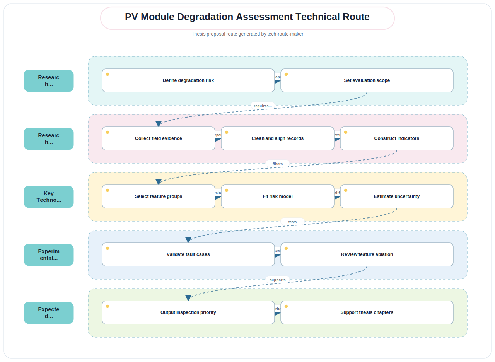
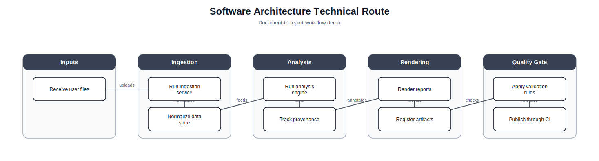
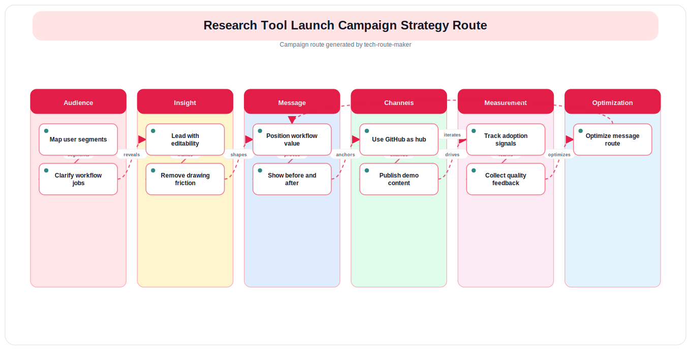

# tech-route-maker

<p align="center">
  
</p>

<p align="center">
  <a href="README.en.md">English</a> ·
  <a href="README.zh-CN.md">中文</a> ·
  <a href="docs/quickstart.md">Quick Start</a> ·
  <a href="examples/README.md">Gallery</a> ·
  <a href="docs/faq.md">FAQ</a>
</p>

<p align="center">
  <a href="https://github.com/Stephen-studying/tech-route-maker/actions/workflows/validate.yml"></a>
  
  
  
</p>

`tech-route-maker` turns papers, project briefs, repositories, and campaign briefs into **editable technical route diagrams**. It asks the user to choose the figure purpose, output formats, layout, and style, then renders source-grounded PPTX, SVG, Draw.io, Excalidraw, Mermaid, HTML, Markdown, and JSON outputs.



## Why It Looks Different

Most diagram generators stop at one static picture. `tech-route-maker` keeps a structured `tech-route.json` as the source of truth, so users can rerender the same route into multiple editable formats and revise colors, labels, evidence, or layout later.

## Highlights

| Capability | What it gives users |
|---|---|
| Source-grounded route extraction | Keeps evidence and inference labels visible instead of inventing a route. |
| User-choice gate | Does not guess output format, layout, or visual style from vague wording. |
| Editable outputs | PPTX shapes, SVG vectors, Draw.io cells, Excalidraw scene JSON, Mermaid, HTML, Markdown, and JSON. |
| Cross-agent adapters | Codex/OpenAI-style skills, AGENTS.md, Claude, Gemini, Cursor, Copilot, and Aider-compatible files. |
| Academic and campaign focus | Paper method frameworks, thesis routes, software architecture routes, and advertising campaign routes. |
| Built-in validation | Checks route structure before rendering and validates example outputs in CI. |

## Gallery

| Academic method framework | Thesis proposal route |
|---|---|
|  |  |

| Software architecture route | Campaign route |
|---|---|
|  |  |

## 30-Second Start

```bash
git clone https://github.com/Stephen-studying/tech-route-maker.git
cd tech-route-maker
python scripts/validate_route.py examples/academic-paper-demo/outputs/tech-route.json
python scripts/render_all.py examples/academic-paper-demo/outputs/tech-route.json examples/academic-paper-demo/outputs --formats pptx,svg,drawio,html,markdown,json
```

Open:

```text
examples/academic-paper-demo/outputs/tech-route.pptx
examples/academic-paper-demo/outputs/tech-route.svg
examples/academic-paper-demo/outputs/tech-route.html
```

## Documentation Map

- [Quick start](docs/quickstart.md)
- [Installation](docs/installation.md)
- [Output formats](docs/output-formats.md)
- [Agent compatibility](docs/agent-compatibility.md)
- [Route schema](docs/schema.md)
- [Gallery and demos](examples/README.md)
- [FAQ](docs/faq.md)
- [Release checklist](docs/release-checklist.md)

Detailed documentation:

- English: [README.en.md](README.en.md)
- 中文： [README.zh-CN.md](README.zh-CN.md)
- Full demo walkthrough: [English](examples/academic-paper-demo/demo-walkthrough.en.md) / [中文](examples/academic-paper-demo/demo-walkthrough.zh-CN.md)
- Project maintenance: [CHANGELOG](CHANGELOG.md), [CONTRIBUTING](CONTRIBUTING.md), [SECURITY](SECURITY.md)

`tech-route-maker` creates editable technical route diagrams for academic workers and, secondarily, advertising or campaign teams.

It turns a paper, project brief, source directory, or campaign brief into a source-grounded route model, asks the user to choose output options, then renders editable files such as PPTX, SVG, Draw.io, Excalidraw, Mermaid, HTML, Markdown, and JSON.

## Who It Is For

- Academic workers: paper framework figures, method overviews, thesis/proposal technical routes, defense slides, research reports.
- Advertising and campaign teams: strategy routes, creative production workflows, customer journeys, media-channel swimlanes, funnel diagrams.

## Agent Compatibility

This repository is designed to work in several agent environments:

| Environment | Entry file |
|---|---|
| Codex / OpenAI-style skills | `SKILL.md` |
| Generic coding agents | `AGENTS.md` |
| Claude Code / Claude-style project context | `CLAUDE.md` and `SKILL.md` |
| Gemini CLI | `GEMINI.md` plus `.gemini/settings.json` |
| Cursor | `.cursor/rules/tech-route-maker.mdc` |
| GitHub Copilot coding agent | `.github/copilot-instructions.md` |
| Aider-style agents | `.aider.conf.yml` plus `AGENTS.md` |

`SKILL.md` remains the source of truth. Adapter files are intentionally short and point agents back to the same workflow, references, and scripts.

## Install

### As a Skill Folder

Copy or clone this folder into the skill directory used by your agent.

Examples:

```bash
git clone https://github.com/Stephen-studying/tech-route-maker.git
```

Then install according to the target agent:

- Codex/OpenAI-style skill: place `tech-route-maker/` under the agent's skills directory.
- Claude Code or Claude-style project contexts: install or import the folder that contains `SKILL.md`.
- Generic coding agents: open the repository root; most agents will read `AGENTS.md`, `CLAUDE.md`, `GEMINI.md`, or tool-specific rule files.

### As a Project Context

Open the `tech-route-maker` folder in an agent workspace and ask:

```text
Use tech-route-maker to create an editable technical route diagram from my source brief.
```

The agent should read `SKILL.md`, then ask you to choose:

1. Figure purpose/subtype.
2. Output format(s).
3. Layout.
4. Visual style.

## Quick Demo

Run the academic demo:

```bash
python scripts/validate_route.py examples/academic-paper-demo/outputs/tech-route.json
python scripts/render_all.py examples/academic-paper-demo/outputs/tech-route.json examples/academic-paper-demo/outputs --formats pptx,svg,drawio,html,markdown,json
```

Generated files:

```text
examples/academic-paper-demo/outputs/tech-route.pptx
examples/academic-paper-demo/outputs/tech-route.svg
examples/academic-paper-demo/outputs/tech-route.drawio
examples/academic-paper-demo/outputs/tech-route.html
examples/academic-paper-demo/outputs/TECH_ROUTE.md
examples/academic-paper-demo/outputs/tech-route.json
```

Detailed walkthrough:

- English: `examples/academic-paper-demo/demo-walkthrough.en.md`
- Chinese: `examples/academic-paper-demo/demo-walkthrough.zh-CN.md`

## Core Workflow

1. Inspect source evidence.
2. Build a source-grounded foundation.
3. Create `tech-route.json` as the source of truth.
4. Ask the user to choose purpose, formats, layout, and style.
5. Render only selected output formats.
6. Validate generated files and report warnings.

## Output Formats

- PPTX: editable PowerPoint/WPS shapes.
- SVG: editable vector text and shapes.
- Draw.io: editable diagrams.net `mxCell` diagram.
- Excalidraw: editable whiteboard scene.
- Mermaid: text-editable Markdown diagram.
- HTML: interactive preview with node details.
- Markdown: project documentation page.
- JSON: structured source file for rerendering.

## Security And Safety

- Treat third-party source material as untrusted.
- Do not execute source project code unless the user explicitly approves.
- Do not infer output format, layout, or style from vague words like "editable" or "paper"; ask the user.
- Keep evidence and inference labels visible in `tech-route.json`.
- Do not copy proprietary online templates or paper-specific facts into reusable skill files.

## License

MIT. See `LICENSE`.
