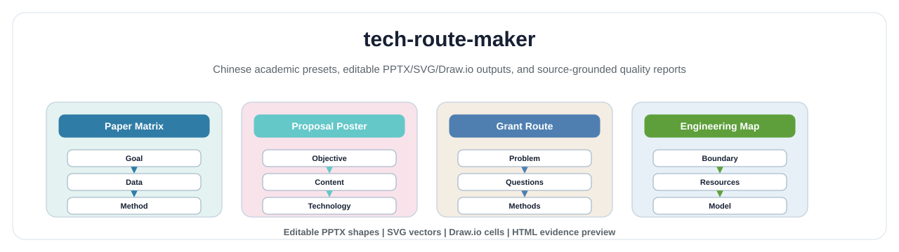
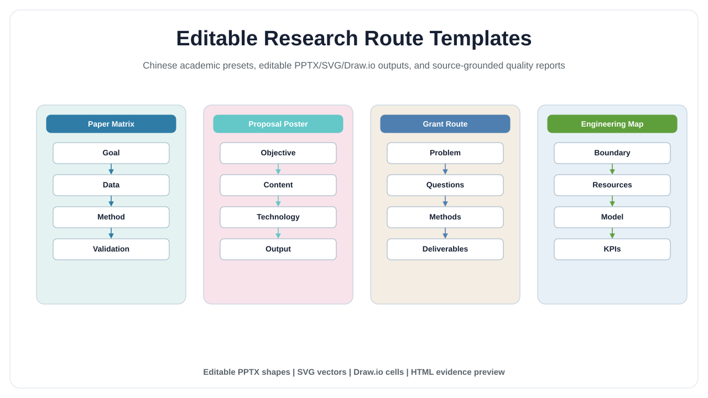

# tech-route-maker

<p align="center">
  
</p>

<p align="center">
  <a href="README.zh-CN.md">Chinese guide</a> |
  <a href="README.en.md">English guide</a> |
  <a href="docs/quickstart.md">Quick start</a> |
  <a href="examples/README.md">Example gallery</a> |
  <a href="https://app.diagrams.net/">diagrams.net / draw.io</a> |
  <a href="docs/comparison-before-after.md">Before/after comparison</a> |
  <a href="docs/faq.md">FAQ</a>
</p>

<p align="center">
  <a href="https://github.com/Stephen-studying/tech-route-maker/actions/workflows/validate.yml"></a>
  
  
  
</p>

Evidence-grounded editable technical route diagrams for research and engineering projects.

`tech-route-maker` is an agent skill and renderer toolkit for turning research papers, thesis proposals, engineering reports, project documentation, and technical notes into editable technical route diagrams. It keeps a structured `tech-route.json` as the source of truth, then renders the same route model into editable PPTX, SVG, Draw.io, Draw.io copy-code XML, HTML, Markdown, Mermaid, Excalidraw, and JSON outputs.



> **Use as an editable draft, not as a final unchecked figure.** Generated diagrams are starting points for revision. Users should review facts, terminology, evidence, logic, layout, colors, and wording before using the PPTX, SVG, or Draw.io files in papers, thesis defenses, grant proposals, courses, or engineering reports.

> **Field context is required.** The skill should not render a final route from a field-agnostic request. It first identifies the discipline, subfield, project type, research object, method family, constraints and evaluation metrics, then chooses a field-appropriate route grammar.

The optional `assets/github-visual-preview.png` file is only a GitHub visual preview. It does not replace the editable PPTX, SVG, Draw.io, HTML, Markdown, Mermaid, Excalidraw, or JSON deliverables.

## Why This Project Exists

Most diagram tools create static figures or one-off drawings. They are hard to audit, hard to revise, and hard to regenerate. This project separates route reasoning from visual rendering:

1. Extract a route model from source materials.
2. Keep nodes and edges traceable through evidence.
3. Store the route as reusable JSON.
4. Render it into editable presentation and documentation formats.
5. Generate a quality report so missing evidence and assumptions are visible.

## Core Features

| Feature | Value |
|---|---|
| Evidence-grounded route model | Keeps visible nodes traceable to source materials or marked assumptions. |
| Reusable JSON source | Stores the route as `tech-route.json` for re-rendering and version control. |
| Editable outputs | Generates PPTX, SVG, Draw.io and other editable formats instead of screenshots. |
| Draw.io copy code | Generates `tech-route.drawio-code.xml` that users can paste into [diagrams.net / draw.io](https://app.diagrams.net/) through **Extras > Edit Diagram**. |
| Domain-aware extraction | Separates computer vision, materials, energy systems, biomedical, mechanical, environmental and social-science route grammar. |
| Research and engineering presets | Provides templates for academic methods, thesis proposals, engineering systems and technical workflows. |
| Verified source manifest | Resolves source paths and checks SHA-256 hashes before evidence is trusted. |
| Strict final-quality gate | Blocks final rendering when domain context, evidence, source hashes or unresolved questions are incomplete. |
| Quality report | Separates evidence coverage, inferred coverage and accounted coverage instead of counting inference as evidence. |
| Agent-compatible instructions | Works with Codex/OpenAI-style agents, Claude, Gemini, Cursor, Copilot, Aider and generic coding agents. |

## Default Presets

| Preset | Use when | Default outputs |
|---|---|---|
| `academic-method` | A paper, manuscript, review, experiment, method section or academic figure is the source. | `pptx`, `svg`, `json` |
| `thesis-proposal` | A thesis proposal, research plan, grant proposal or topic application needs a technical route. | `pptx`, `svg`, `drawio`, `json` |
| `engineering-system` | An engineering system, energy system, control system, platform, hardware or software architecture needs a route diagram. | `pptx`, `svg`, `drawio`, `html`, `json` |
| `workflow-pipeline` | A tool, agent workflow, automation process, pipeline or documentation route needs to be explained. | `svg`, `markdown`, `mermaid`, `json` |
| `chinese-thesis-proposal` | A Chinese thesis proposal, opening report, topic application or research plan needs a polished poster-style route. | `pptx`, `svg`, `drawio`, `html`, `json` |
| `chinese-grant-application` | A Chinese grant, project application or reviewer-facing research route needs a dense but organized editable diagram. | `pptx`, `svg`, `drawio`, `html`, `markdown`, `json` |
| `academic-paper-framework-cn` | A Chinese academic method framework or paper figure needs a matrix-style route. | `pptx`, `svg`, `drawio`, `json` |
| `engineering-project-report-cn` | A Chinese engineering report, platform map or energy-system route needs a wide project diagram. | `pptx`, `svg`, `drawio`, `html`, `json` |

The skill offers preset defaults, then confirms final formats, target medium, layout and style in one concise grouped choice. It does not silently guess these delivery preferences.

## Gallery

| Demo | Audience | Route type | Preview |
|---|---|---|---|
| [Academic paper method route](examples/academic-paper-demo/) | Research paper or defense | Method framework | [SVG](examples/academic-paper-demo/outputs/tech-route.svg) |
| [Thesis proposal technical route](examples/thesis-proposal-demo/) | Thesis, proposal, research plan | Proposal route | [SVG](examples/thesis-proposal-demo/outputs/tech-route.svg) |
| [Chinese grant application route](examples/chinese-grant-application-demo/) | Grant or project application | Application route | [SVG](examples/chinese-grant-application-demo/outputs/tech-route.svg) |
| [Engineering energy system route](examples/engineering-energy-system-demo/) | Engineering report or course design | Source-grid-load-storage route | [SVG](examples/engineering-energy-system-demo/outputs/tech-route.svg) |
| [Biomedical mechanism route](examples/biomedical-mechanism-demo/) | Biomedical proposal or paper | Mechanism validation route | [SVG](examples/biomedical-mechanism-demo/outputs/tech-route.svg) |
| [Draw.io copy-code HGDY route](examples/drawio-copy-code-demo/) | Project application or route handoff | Copyable Draw.io XML | [XML](examples/drawio-copy-code-demo/outputs/tech-route.drawio-code.xml) |
| [Agent workflow route](examples/agent-workflow-demo/) | Skill/tool documentation | Workflow pipeline | [SVG](examples/agent-workflow-demo/outputs/tech-route.svg) |

## Install As An Agent Skill

With GitHub CLI 2.96 or newer, install the repository's root `SKILL.md` directly. Replace the agent value as needed:

```bash
gh skill install Stephen-studying/tech-route-maker SKILL.md --agent codex --scope user
gh skill install Stephen-studying/tech-route-maker SKILL.md --agent claude-code --scope user
gh skill install Stephen-studying/tech-route-maker SKILL.md --agent cursor --scope user
gh skill install Stephen-studying/tech-route-maker SKILL.md --agent gemini-cli --scope user
gh skill install Stephen-studying/tech-route-maker SKILL.md --agent github-copilot --scope user
```

GitHub CLI also supports project scope and many additional agents. See [Agent compatibility](docs/agent-compatibility.md) for the full workflow and the generic fallback installer.

## Quick Start

```bash
git clone https://github.com/Stephen-studying/tech-route-maker.git
cd tech-route-maker
python -m pip install -e .
trm doctor
trm validate examples/academic-paper-demo/outputs/tech-route.json --strict
trm render examples/academic-paper-demo/outputs/tech-route.json examples/academic-paper-demo/outputs --formats pptx,svg,drawio,drawio-code,excalidraw,mermaid,html,markdown,json
```

For a new project, inventory source files before extracting route nodes:

```bash
trm ingest path/to/paper-or-project --output-dir evidence-pack
trm init --preset academic-method --output work/tech-route.json --quality-report
```

Fill the generated `source.md` and `tech-route.json`, then run `trm validate --strict`. Final rendering is blocked until the discipline context is complete, all sources match their SHA-256 hashes, every visible node has verified evidence, and no unresolved question or inferred node remains. `trm render ... --allow-draft` is available only for explicitly unfinished working drafts.

After rendering, open:

```text
examples/academic-paper-demo/outputs/tech-route.pptx
examples/academic-paper-demo/outputs/tech-route.svg
examples/academic-paper-demo/outputs/tech-route.drawio
examples/academic-paper-demo/outputs/tech-route.drawio-code.xml
examples/academic-paper-demo/outputs/tech-route.html
examples/academic-paper-demo/outputs/QUALITY_REPORT.md
```

## Draw.io Copy-Code Workflow

Use this when a user wants code that can be copied into Draw.io instead of downloading a file.

```bash
python scripts/render_all.py examples/drawio-copy-code-demo/outputs/tech-route.json examples/drawio-copy-code-demo/outputs --formats drawio,drawio-code,svg,json
```

Then:

1. Open [diagrams.net / draw.io](https://app.diagrams.net/).
2. Create a blank diagram.
3. Open `examples/drawio-copy-code-demo/outputs/tech-route.drawio-code.xml`.
4. Copy all XML text.
5. In diagrams.net, use **Extras > Edit Diagram**, paste the XML, and confirm.

This produces an editable Draw.io diagram. Users can still edit text, colors, arrows and boxes after import.

## Editable Outputs

| Format | File | Editable in | Best for |
|---|---|---|---|
| PPTX | `tech-route.pptx` | PowerPoint, WPS | Defense slides, reports, teaching and review decks. |
| SVG | `tech-route.svg` | Figma, Illustrator, Inkscape, browser | High-resolution vector editing and publication polishing. |
| Draw.io | `tech-route.drawio` | diagrams.net | Long-term technical diagram maintenance. |
| Draw.io code | `tech-route.drawio-code.xml` | diagrams.net XML editor | Copy-paste import into [draw.io](https://app.diagrams.net/). |
| Excalidraw | `tech-route.excalidraw` | Excalidraw | Whiteboard-style review and lightweight edits. |
| Mermaid | `tech-route.mmd` | Text editor, GitHub Markdown | Version-controlled diagrams. |
| HTML | `tech-route.html` | Browser and code editor | Interactive preview with details and evidence. |
| Markdown | `TECH_ROUTE.md` | Any Markdown editor | README, project documentation and handoff notes. |
| JSON | `tech-route.json` | Any text editor | Source of truth for rerendering and theme changes. |
| Quality report | `QUALITY_REPORT.md` | Any Markdown editor | Evidence coverage, warnings and manual review checklist. |

## Agent Compatibility

This repository is intentionally agent-agnostic. `SKILL.md` is the source of truth. Adapter files point other agents to the same workflow:

- `AGENTS.md` for generic coding agents.
- `CLAUDE.md` for Claude-style project context.
- `GEMINI.md` and `.gemini/settings.json` for Gemini CLI.
- `.cursor/rules/tech-route-maker.mdc` for Cursor.
- `.github/copilot-instructions.md` for GitHub Copilot coding agent.
- `.aider.conf.yml` for Aider-style workflows.

The preferred installer is `gh skill install ... SKILL.md --agent <agent> --scope user`. Agents without GitHub CLI skill support can use `python scripts/install_agent_skill.py --target <skill-parent-directory> --agent <name>`; the destination is always explicit and the installer never guesses a private agent path.

## Experimental / Legacy Use Cases

Campaign and advertising diagrams are not the core direction of this project. They are kept only as legacy or experimental examples for users who already need them. The default skill behavior is optimized for research, thesis, engineering and workflow diagrams.

## Repository Structure

```text
tech-route-maker/
  SKILL.md                         # Core skill instructions.
  agents/openai.yaml               # OpenAI-style skill UI metadata.
  AGENTS.md                        # Portable agent instructions.
  docs/                            # Quick start, schema, formats, FAQ.
  references/                      # Route schema, layout and visual references.
  scripts/                         # Backward-compatible validation and render scripts.
  tech_route_maker/                # Python package and CLI.
  examples/                        # Research and engineering demos.
  assets/                          # README banner and preview assets.
```

## Safety

- Treat third-party project files as untrusted.
- Do not execute analyzed project code unless the user explicitly approves.
- Keep evidence, assumptions and inference labels visible in `tech-route.json`.
- Do not copy proprietary templates, online images, or paper-specific facts into reusable skill files.
- Chinese academic styles are recreated as original editable vector templates; local/private reference images are not bundled into the public repository.
- Preserve editability. Do not replace PPTX, SVG, Draw.io, or Excalidraw outputs with screenshots.

## License

MIT. See [LICENSE](LICENSE).
