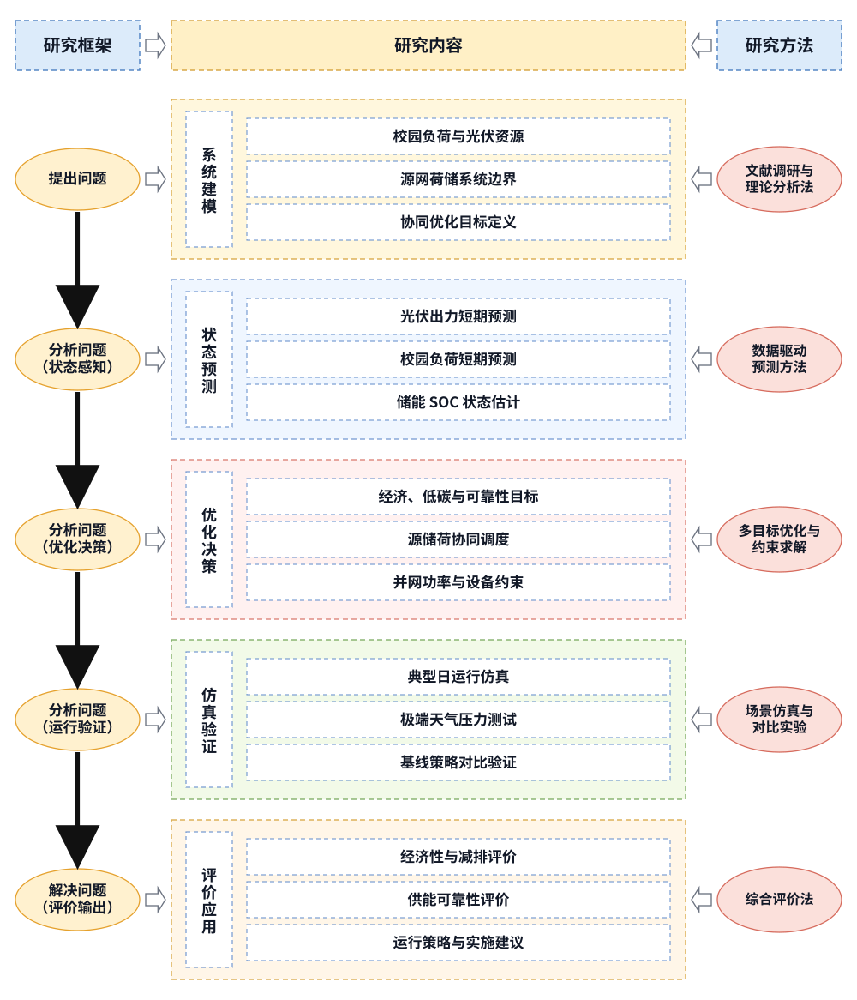

<div align="center">

# 🧭 tech-route-maker

### 可编辑科研技术路线图生成器

**把论文、开题与工程材料，转换成有证据依据、可重新渲染的技术路线图。**

简体中文 · [英文版](README.en.md)

[](SKILL.md)
[](pyproject.toml)
[](https://github.com/Stephen-studying/tech-route-maker/actions/workflows/validate.yml)
[](#支持的可编辑输出)
[](LICENSE)

[项目简介](#项目简介) · [核心特点](#核心特点) · [模板库](#结构模板库) · [适用场景](#适用场景) · [快速开始](#快速开始) · [安全原则](#安全原则)

</div>

---

## 项目简介

面向科研与工程项目的证据驱动型可编辑技术路线图生成 技能。

`tech-route-maker` 是一个可被 Codex、Claude、Gemini、Cursor、Copilot、Aider 等 智能体 使用的技能包和渲染工具。它把论文、开题报告、工程报告、课程设计、项目文档和技术笔记转换为可审查的 `tech-route.json` 路线模型，再渲染为 PPTX、SVG、Draw.io、Draw.io 可复制 XML 代码、Excalidraw、Mermaid、HTML、Markdown 和 JSON 等可编辑文件。

> **重要提醒**：自动生成的路线图更适合作为可编辑初稿和设计起点，不能不经检查就直接用于论文投稿、毕业答辩、课题申报、课程设计或工程报告。用户需要继续核对事实、术语、逻辑、证据来源、颜色、版式和文字表达，并在 PPTX、SVG 或 Draw.io 等可编辑文件中进行二次修改。

## 工作流程

> **① 导入材料** → **② 定位证据** → **③ 建立模型** → **④ 严格验证** → **⑤ 多格式渲染**
>
> 来源清单 · 精确定位 · `tech-route.json` · 质量门槛 · 可编辑输出

## 核心思路

技术路线图不是普通装饰性流程图。一个真正可用的科研或工程路线图至少要回答四个问题：

1. 每个可见步骤是否能追溯到源材料？
2. 哪些内容是证据支持，哪些内容是合理推断？
3. 输出文件能否继续修改，而不是一张截图？
4. 同一个路线模型能否反复渲染为不同格式？

`tech-route-maker` 用 `tech-route.json` 保存路线结构、阶段、节点、连线、证据、推断、假设、未解决问题和渲染配置。渲染脚本再把同一个 JSON 转换为多种可编辑格式。

## 核心特点

| 能力 | 对用户的价值 |
|---|---|
| 证据驱动路线模型 | 每个可见节点都需要来源证据，无法确认的内容标记为推断。 |
| JSON 源文件复用 | 使用 `tech-route.json` 保存路线结构，便于后续修改、复渲染和版本管理。 |
| 可编辑输出 | 生成 PPTX、SVG、Draw.io 等可编辑文件，而不是一次性截图。 |
| Draw.io 复制代码 | 生成 `tech-route.drawio-code.xml`，用户可以复制到 [diagrams.net / draw.io](https://app.diagrams.net/) 的 XML 编辑窗口中直接生成可编辑图。 |
| 科研与工程预设 | 面向论文方法图、开题技术路线、工程系统路线和技术工作流。 |
| 结构模板库 | 按研究逻辑、内容、方法等语义角色套用固定结构，并保留可编辑性。 |
| 来源清单与哈希校验 | 在采信证据前定位来源文件并核对 SHA-256，防止来源被替换或路径失效。 |
| 严格最终质量门槛 | 学科上下文、来源哈希、节点证据或未解决问题不完整时，默认禁止正式渲染。 |
| 质量报告 | 分开报告真实证据覆盖率、推断覆盖率和已说明覆盖率，不再把推断算作证据。 |
| 多智能体适配 | 提供 Codex/OpenAI-style、Claude、Gemini、Cursor、Copilot、Aider 等说明文件。 |

## 默认预设

| 预设 | 适用场景 | 默认输出 |
|---|---|---|
| `academic-method` | 论文、manuscript、review、method、experiment、学术图。 | `pptx`, `svg`, `json` |
| `thesis-proposal` | 开题报告、research plan、课题申报、基金申请。 | `pptx`, `svg`, `drawio`, `json` |
| `engineering-system` | 工程系统、能源系统、控制系统、硬件系统、平台设计。 | `pptx`, `svg`, `drawio`, `html`, `json` |
| `workflow-pipeline` | 软件工具、智能体技能、处理管线、工作流、自动化和文档流程。 | `svg`, `markdown`, `mermaid`, `json` |
| `chinese-thesis-proposal` | 中文开题报告、课题申报、论文技术路线和研究方案。 | `pptx`, `svg`, `drawio`, `html`, `json` |
| `chinese-grant-application` | 中文基金申请、项目申请和申报书技术路线。 | `pptx`, `svg`, `drawio`, `html`, `markdown`, `json` |
| `academic-paper-framework-cn` | 中文论文方法框架图、研究框架图和学术图。 | `pptx`, `svg`, `drawio`, `json` |
| `engineering-project-report-cn` | 中文工程项目汇报、平台建设和能源系统路线图。 | `pptx`, `svg`, `drawio`, `html`, `json` |

技能会先给出推荐预设，再用一个简洁的组合问题确认最终输出格式、使用媒介、版式和风格；用户可以单选或多选，Skill 不会默默猜测这些交付偏好。

## 结构模板库

执行 `trm templates` 可以查看 6 套可填充的结构模板。用户明确指定模板时，智能体直接套用；模板选择不明确时，先询问用户。学科与项目事实仍需根据来源材料确认。

| 模板 | 适用场景 |
|---|---|
| `cn-three-column-research-framework` | 三栏科研框架：左侧研究逻辑、中间研究内容、右侧研究方法 |
| `cn-horizontal-defense-mainline` | 16:9 答辩与项目汇报主线图 |
| `cn-a4-stacked-research` | Word、论文与竖版报告插图 |
| `cn-method-matrix-board` | 论文方法总览与研究矩阵 |
| `cn-monochrome-review-route` | 黑白打印与正式评审 |
| `cn-engineering-layer-map` | 能源、控制、平台与工程系统分层图 |

可以直接向智能体提出：

> 使用 tech-route-maker，套用三栏科研框架模板，根据我的项目材料生成 PPTX、SVG 和 Draw.io 文件。

CLI 用法：

```bash
trm templates
trm init --template cn-three-column-research-framework --output work/tech-route.json
```

初始模板是待填写的骨架。补充领域信息、项目内容和来源证据，执行严格校验后，再输出所需格式。详见 [模板目录](references/template-catalog.md)。

### 模板套用示例



[完整案例](examples/template-library-demo/) · [可编辑 PPTX](examples/template-library-demo/outputs/tech-route.pptx) · [SVG](examples/template-library-demo/outputs/tech-route.svg) · [Draw.io](examples/template-library-demo/outputs/tech-route.drawio) · [可复制 XML](examples/template-library-demo/outputs/tech-route.drawio-code.xml)

## 适用场景

科研和学术用户可以用于：

- 论文方法框架图。
- 研究技术路线图。
- 开题报告技术路线图。
- 毕业答辩、组会汇报和学术报告中的方法图。
- 课题申报书、基金申请书中的技术路线。
- AI、机器学习、计算机视觉、NLP 或数据分析流程图。
- 带证据链的方法总览图。
- baseline 与改进方法对比图。

工程用户可以用于：

- 源网荷储一体化能源系统路线图。
- 系统架构和数据流路线图。
- 控制、感知、验证和部署路线图。
- 课程设计和工程报告图。
- 智能体、工具链、自动化流程和文档工作流。

广告和 campaign 场景只作为 legacy/experimental 示例保留，不再作为项目核心定位。

## 安装到不同智能体

GitHub CLI 2.96 及以上版本可以直接安装仓库根目录的 `SKILL.md`。根据使用的软件选择 `--agent`：

```bash
gh skill install Stephen-studying/tech-route-maker SKILL.md --agent codex --scope user
gh skill install Stephen-studying/tech-route-maker SKILL.md --agent claude-code --scope user
gh skill install Stephen-studying/tech-route-maker SKILL.md --agent cursor --scope user
gh skill install Stephen-studying/tech-route-maker SKILL.md --agent gemini-cli --scope user
gh skill install Stephen-studying/tech-route-maker SKILL.md --agent github-copilot --scope user
```

更多智能体、项目级安装和无 GitHub CLI 的通用安装方式见 [智能体兼容性说明](docs/agent-compatibility.md)。

## 快速开始

```bash
git clone https://github.com/Stephen-studying/tech-route-maker.git
cd tech-route-maker
python -m pip install -e .
trm doctor
trm templates
trm validate examples/academic-paper-demo/outputs/tech-route.json --strict
trm render examples/academic-paper-demo/outputs/tech-route.json examples/academic-paper-demo/outputs --formats pptx,svg,drawio,drawio-code,excalidraw,mermaid,html,markdown,json
```

新项目先建立来源清单和证据包：

```bash
trm ingest 论文或项目资料目录 --output-dir evidence-pack
trm init --preset academic-method --output work/tech-route.json --quality-report
```

填写生成的 `source.md` 与 `tech-route.json` 后，执行 `trm validate --strict`。只有学科上下文完整、全部来源通过 SHA-256 校验、每个可见节点都有已验证证据，且不存在推断节点和未解决问题时，才允许正式渲染。`--allow-draft` 只用于明确标注的未完成草稿。

生成后可以打开：

```text
examples/academic-paper-demo/outputs/tech-route.pptx
examples/academic-paper-demo/outputs/tech-route.svg
examples/academic-paper-demo/outputs/tech-route.drawio
examples/academic-paper-demo/outputs/tech-route.drawio-code.xml
examples/academic-paper-demo/outputs/tech-route.html
examples/academic-paper-demo/outputs/QUALITY_REPORT.md
```

如果已经本地安装 CLI，也可以使用：

```bash
pip install -e .
trm validate examples/academic-paper-demo/outputs/tech-route.json
trm render examples/academic-paper-demo/outputs/tech-route.json examples/academic-paper-demo/outputs --formats pptx,svg,drawio,html,markdown,json
```

## Draw.io 复制代码用法

当用户希望获得“可以复制到 draw.io 里直接生成图的代码”时，选择 `drawio-code` 输出：

```bash
python scripts/render_all.py examples/drawio-copy-code-demo/outputs/tech-route.json examples/drawio-copy-code-demo/outputs --formats drawio,drawio-code,svg,json
```

使用步骤：

1. 打开 [diagrams.net / draw.io](https://app.diagrams.net/)。
2. 新建一个空白图。
3. 打开 `examples/drawio-copy-code-demo/outputs/tech-route.drawio-code.xml`，复制全部 XML 文本。
4. 在 diagrams.net 中选择 **Extras > Edit Diagram**。
5. 粘贴 XML 并确认。
6. 生成后可以继续修改文字、颜色、箭头和模块。

## 支持的可编辑输出

| 格式 | 文件 | 可编辑工具 | 适合场景 |
|---|---|---|---|
| PPTX | `tech-route.pptx` | PowerPoint、WPS | 答辩、汇报、课程展示和报告。 |
| SVG | `tech-route.svg` | Figma、Illustrator、Inkscape、浏览器 | 高清矢量编辑和论文级美化。 |
| Draw.io | `tech-route.drawio` | diagrams.net | 长期维护技术图。 |
| Draw.io 代码 | `tech-route.drawio-code.xml` | diagrams.net XML 编辑窗口 | 复制粘贴到 [draw.io](https://app.diagrams.net/) 生成可编辑图。 |
| Excalidraw | `tech-route.excalidraw` | Excalidraw | 白板讨论和轻量修改。 |
| Mermaid | `tech-route.mmd` | 文本编辑器、GitHub Markdown | 版本管理和文档化。 |
| HTML | `tech-route.html` | 浏览器和代码编辑器 | 交互式预览、节点详情和证据说明。 |
| Markdown | `TECH_ROUTE.md` | 任意 Markdown 编辑器 | README、项目文档、交接说明。 |
| JSON | `tech-route.json` | 任意文本编辑器 | 重新渲染和修改主题的源文件。 |
| 质量报告 | `QUALITY_REPORT.md` | 任意 Markdown 编辑器 | 证据覆盖率、warning 和人工复核清单。 |

## 多智能体适配

这个仓库不绑定单一智能体。`SKILL.md` 是核心说明文件，其他适配文件用于让不同智能体读取同一套工作流：

- `AGENTS.md`：通用 coding 智能体。
- `CLAUDE.md`：Claude-style 项目上下文。
- `GEMINI.md` 和 `.gemini/settings.json`：Gemini CLI。
- `.cursor/rules/tech-route-maker.mdc`：Cursor。
- `.github/copilot-instructions.md`：GitHub Copilot coding 智能体。
- `.aider.conf.yml`：Aider-style 工作流。

推荐使用 `gh skill install ... SKILL.md --agent <agent> --scope user`。不支持该命令的智能体可以使用：

```bash
python scripts/install_agent_skill.py --target <该软件的技能父目录> --agent <软件名称>
```

安装目标必须由用户明确提供，脚本不会猜测不同软件的私有目录。

## 历史与实验性场景

广告活动路线图、campaign strategy map、customer journey、media-channel swimlane 等场景只作为 legacy 或 experimental 示例保留。默认工作流优先服务科研、开题、工程系统和技术工作流。

## 安全原则

- 把第三方项目文件视为不可信输入。
- 除非用户明确同意，不执行被分析项目中的代码。
- 在 `tech-route.json` 中保留 evidence、assumption 和 inference 标记。
- 不把专有模板、网络图片或特定论文事实复制进通用 技能 文件。
- 中文科研审美样式以原创可编辑矢量模板重建，不把本地或私有参考图片打包进公开仓库。
- 保留可编辑性，不用截图替代 PPTX、SVG、Draw.io 或 Excalidraw 主输出。

## 许可证

MIT，见 `LICENSE`。
