# PV Surface Defect Detection Method Route

Academic method framework demo generated by tech-route-maker

```mermaid
flowchart LR
  title["PV Surface Defect Detection Method Route"]
  subgraph goal["Research Goal"]
    goal_task["Define defect task"]
    goal_metric["Set evaluation metrics"]
  end
  subgraph data["Data Evidence"]
    data_collect["Collect RGB and IR images"]
    data_align["Align and annotate defects"]
    data_split["Prepare train test sets"]
  end
  subgraph method["Method Design"]
    method_baseline["Build baseline detector"]
    method_fusion["Fuse multimodal features"]
    method_attention["Enhance weak regions"]
  end
  subgraph training["Training Validation"]
    training_loss["Optimize detection losses"]
    training_ablation["Run ablation studies"]
    training_infer["Infer defect candidates"]
  end
  subgraph output["Validation Output"]
    output_metrics["Report quantitative gains"]
    output_visual["Explain visual results"]
    output_report["Generate defect report"]
  end
  goal_task -->|defines| goal_metric
  goal_metric -->|guides| data_collect
  data_collect -->|aligns| data_align
  data_align -->|prepares| data_split
  data_split -->|feeds| method_baseline
  method_baseline -->|extends| method_fusion
  method_fusion -->|enhances| method_attention
  method_attention -->|optimizes| training_loss
  training_loss -->|tests| training_ablation
  training_ablation -->|selects| training_infer
  training_infer -->|evaluates| output_metrics
  output_metrics -->|explains| output_visual
  output_visual -->|reports| output_report
```

## Route Evidence

| Stage | Node | Evidence |
|---|---|---|
| Research Goal | Define defect task | source - examples/academic-paper-demo/brief.md |
| Research Goal | Set evaluation metrics | source - examples/academic-paper-demo/brief.md |
| Data Evidence | Collect RGB and IR images | source - examples/academic-paper-demo/brief.md |
| Data Evidence | Align and annotate defects | source - examples/academic-paper-demo/brief.md |
| Data Evidence | Prepare train test sets | source - examples/academic-paper-demo/brief.md |
| Method Design | Build baseline detector | source - examples/academic-paper-demo/brief.md |
| Method Design | Fuse multimodal features | source - examples/academic-paper-demo/brief.md |
| Method Design | Enhance weak regions | source - examples/academic-paper-demo/brief.md |
| Training Validation | Optimize detection losses | source - examples/academic-paper-demo/brief.md |
| Training Validation | Run ablation studies | source - examples/academic-paper-demo/brief.md |
| Training Validation | Infer defect candidates | source - examples/academic-paper-demo/brief.md |
| Validation Output | Report quantitative gains | source - examples/academic-paper-demo/brief.md |
| Validation Output | Explain visual results | source - examples/academic-paper-demo/brief.md |
| Validation Output | Generate defect report | source - examples/academic-paper-demo/brief.md |
