# 多模态光伏缺陷检测技术路线图

Academic method framework demo generated by tech-route-maker

```mermaid
flowchart LR
  title["多模态光伏缺陷检测技术路线图"]
  subgraph objective["研究目标"]
    objective_task["明确缺陷检测任务"]
    objective_metrics["设定评价指标"]
  end
  subgraph data["数据与样本"]
    data_capture["采集多模态图像"]
    data_align["配准与标注缺陷"]
    data_split["划分训练样本"]
  end
  subgraph method["方法设计"]
    method_baseline["建立基线检测器"]
    method_fusion["构建跨模态融合"]
    method_attention["增强关键区域感知"]
  end
  subgraph training["训练优化"]
    training_loss["设计损失函数"]
    training_ablation["训练与消融实验"]
    training_infer["推理并筛选结果"]
  end
  subgraph output["验证输出"]
    output_metrics["完成指标评估"]
    output_visual["生成可视化解释"]
    output_report["输出缺陷报告"]
  end
  objective_task -->|defines| objective_metrics
  objective_metrics -->|guides data| data_capture
  data_capture -->|aligns| data_align
  data_align -->|prepares| data_split
  data_split -->|feeds model| method_baseline
  method_baseline -->|extends| method_fusion
  method_fusion -->|enhances| method_attention
  method_attention -->|optimizes| training_loss
  training_loss -->|tests| training_ablation
  training_ablation -->|selects| training_infer
  training_infer -->|evaluates| output_metrics
  output_metrics -->|explains| output_visual
  output_visual -->|reports| output_report
```

## Route Evidence

| Stage | Node | Evidence |
|---|---|---|
| 研究目标 | 明确缺陷检测任务 | document - examples/academic-paper-demo/source/project-brief.md - Project goal |
| 研究目标 | 设定评价指标 | document - examples/academic-paper-demo/source/project-brief.md - Evaluation target |
| 数据与样本 | 采集多模态图像 | document - examples/academic-paper-demo/source/project-brief.md - Input data |
| 数据与样本 | 配准与标注缺陷 | document - examples/academic-paper-demo/source/project-brief.md - Alignment and annotation |
| 数据与样本 | 划分训练样本 | document - examples/academic-paper-demo/source/project-brief.md - Data split |
| 方法设计 | 建立基线检测器 | document - examples/academic-paper-demo/source/project-brief.md - Baseline detector |
| 方法设计 | 构建跨模态融合 | document - examples/academic-paper-demo/source/project-brief.md - Multimodal feature fusion |
| 方法设计 | 增强关键区域感知 | document - examples/academic-paper-demo/source/project-brief.md - Attention enhancement |
| 训练优化 | 设计损失函数 | document - examples/academic-paper-demo/source/project-brief.md - Loss design |
| 训练优化 | 训练与消融实验 | document - examples/academic-paper-demo/source/project-brief.md - Training and ablation |
| 训练优化 | 推理并筛选结果 | document - examples/academic-paper-demo/source/project-brief.md - Inference and confidence filtering |
| 验证输出 | 完成指标评估 | document - examples/academic-paper-demo/source/project-brief.md - Quantitative metrics |
| 验证输出 | 生成可视化解释 | document - examples/academic-paper-demo/source/project-brief.md - Visualization |
| 验证输出 | 输出缺陷报告 | document - examples/academic-paper-demo/source/project-brief.md - Defect report |
