# 多模态光伏缺陷检测技术路线图

Academic method framework demo generated by tech-route-maker

```mermaid
flowchart LR
  title["多模态光伏缺陷检测技术路线图"]
  subgraph objective["研究目标"]
    objective_goal["明确检测目标"]
  end
  subgraph data["数据构建"]
    data_capture["采集多模态图像"]
    data_screen["图像质量筛选"]
  end
  subgraph preprocess["预处理"]
    preprocess_align["图像配准与标注"]
    preprocess_split["增强并划分数据"]
  end
  subgraph method["核心方法"]
    method_baseline["建立基线检测器"]
    method_fusion["构建特征融合检测器"]
  end
  subgraph train_infer["训练推理"]
    train_supervised["训练与指标优化"]
    infer_filter["推理并筛选结果"]
  end
  subgraph output["验证输出"]
    eval_compare["对比与消融验证"]
    output_report["输出缺陷报告"]
  end
  objective_goal -->|定义输入需求| data_capture
  data_capture -->|质量筛选| data_screen
  data_screen -->|保留有效样本| preprocess_align
  preprocess_align -->|形成训练样本| preprocess_split
  preprocess_split -->|输入基线模型| method_baseline
  method_baseline -->|融合改进| method_fusion
  method_fusion -->|训练优化| train_supervised
  train_supervised -->|模型推理| infer_filter
  infer_filter -->|结果评估| eval_compare
  eval_compare -->|支撑应用| output_report
```

## Route Evidence

| Stage | Node | Evidence |
|---|---|---|
| 研究目标 | 明确检测目标 | document - examples/academic-paper-demo/source/project-brief.md - Project Goal |
| 数据构建 | 采集多模态图像 | document - examples/academic-paper-demo/source/project-brief.md - Input data |
| 数据构建 | 图像质量筛选 | document - examples/academic-paper-demo/source/project-brief.md - Preparation |
| 预处理 | 图像配准与标注 | document - examples/academic-paper-demo/source/project-brief.md - alignment and annotation |
| 预处理 | 增强并划分数据 | document - examples/academic-paper-demo/source/project-brief.md - augmentation and split |
| 核心方法 | 建立基线检测器 | document - examples/academic-paper-demo/source/project-brief.md - baseline detector |
| 核心方法 | 构建特征融合检测器 | document - examples/academic-paper-demo/source/project-brief.md - multimodal feature fusion and attention |
| 训练推理 | 训练与指标优化 | document - examples/academic-paper-demo/source/project-brief.md - training and validation monitoring |
| 训练推理 | 推理并筛选结果 | document - examples/academic-paper-demo/source/project-brief.md - inference and confidence filtering |
| 验证输出 | 对比与消融验证 | document - examples/academic-paper-demo/source/project-brief.md - comparison, ablation, precision/recall/mAP |
| 验证输出 | 输出缺陷报告 | document - examples/academic-paper-demo/source/project-brief.md - defect category, location, confidence, visualization |
