# Document Intelligence System Technical Route

Editable system architecture route generated by tech-route-maker

```mermaid
flowchart LR
  title["Document Intelligence System Technical Route"]
  subgraph input["User Input"]
    input_files["Receive files"]
    input_options["Capture output choices"]
  end
  subgraph data["Data Layer"]
    data_ingest["Ingest sources"]
    data_store["Build normalized store"]
    data_trace["Track provenance"]
  end
  subgraph service["Service Layer"]
    service_extract["Extract route model"]
    service_schema["Validate schema"]
    service_layout["Select template family"]
  end
  subgraph render["Rendering Layer"]
    render_svg["Render SVG/HTML"]
    render_pptx["Render PPTX shapes"]
    render_drawio["Render Draw.io cells"]
  end
  subgraph quality["Quality Release"]
    quality_visual["Run visual QA"]
    quality_publish["Publish examples"]
  end
  input_files -->|configures| input_options
  input_options -->|starts| data_ingest
  data_ingest -->|normalizes| data_store
  data_store -->|links| data_trace
  data_trace -->|grounds| service_extract
  service_extract -->|checks| service_schema
  service_schema -->|routes| service_layout
  service_layout -->|renders| render_svg
  service_layout -->|renders| render_pptx
  service_layout -->|renders| render_drawio
  render_pptx -->|reviews| quality_visual
  quality_visual -->|releases| quality_publish
```

## Route Evidence

| Stage | Node | Evidence |
|---|---|---|
| User Input | Receive files | document - examples/software-architecture-demo/source/project-brief.md - Inputs |
| User Input | Capture output choices | document - examples/software-architecture-demo/source/project-brief.md - Configuration |
| Data Layer | Ingest sources | document - examples/software-architecture-demo/source/project-brief.md - Ingestion service |
| Data Layer | Build normalized store | document - examples/software-architecture-demo/source/project-brief.md - Normalized data store |
| Data Layer | Track provenance | document - examples/software-architecture-demo/source/project-brief.md - Provenance tracking |
| Service Layer | Extract route model | document - examples/software-architecture-demo/source/project-brief.md - Route extraction |
| Service Layer | Validate schema | document - examples/software-architecture-demo/source/project-brief.md - Validation rules |
| Service Layer | Select template family | document - examples/software-architecture-demo/source/project-brief.md - Layout selection |
| Rendering Layer | Render SVG/HTML | document - examples/software-architecture-demo/source/project-brief.md - SVG and HTML |
| Rendering Layer | Render PPTX shapes | document - examples/software-architecture-demo/source/project-brief.md - PPTX |
| Rendering Layer | Render Draw.io cells | document - examples/software-architecture-demo/source/project-brief.md - Draw.io |
| Quality Release | Run visual QA | document - examples/software-architecture-demo/source/project-brief.md - Visual QA |
| Quality Release | Publish examples | document - examples/software-architecture-demo/source/project-brief.md - Release route |
