# Research Tool Launch Campaign Strategy Route

Campaign route generated by tech-route-maker

```mermaid
flowchart LR
  title["Research Tool Launch Campaign Strategy Route"]
  subgraph audience["Audience"]
    audience_segments["Map user segments"]
    audience_jobs["Clarify workflow jobs"]
  end
  subgraph insight["Insight"]
    insight_editable["Lead with editability"]
    insight_friction["Remove drawing friction"]
  end
  subgraph message["Message"]
    message_positioning["Position workflow value"]
    message_proof["Show before and after"]
  end
  subgraph channels["Channels"]
    channels_github["Use GitHub as hub"]
    channels_content["Publish demo content"]
  end
  subgraph measurement["Measurement"]
    measurement_metrics["Track adoption signals"]
    measurement_feedback["Collect quality feedback"]
  end
  subgraph optimization["Optimization"]
    optimization_route["Optimize message route"]
  end
  audience_segments -->|segments| audience_jobs
  audience_jobs -->|reveals| insight_editable
  insight_editable -->|frames| insight_friction
  insight_friction -->|shapes| message_positioning
  message_positioning -->|proves| message_proof
  message_proof -->|anchors| channels_github
  channels_github -->|extends| channels_content
  channels_content -->|drives| measurement_metrics
  measurement_metrics -->|learns| measurement_feedback
  measurement_feedback -->|optimizes| optimization_route
  optimization_route -->|iterates| message_positioning
```

## Route Evidence

| Stage | Node | Evidence |
|---|---|---|
| Audience | Map user segments | document - examples/campaign-route-demo/source/campaign-brief.md - Audience |
| Audience | Clarify workflow jobs | document - examples/campaign-route-demo/source/campaign-brief.md - Jobs to be done |
| Insight | Lead with editability | document - examples/campaign-route-demo/source/campaign-brief.md - Insight |
| Insight | Remove drawing friction | document - examples/campaign-route-demo/source/campaign-brief.md - Pain point |
| Message | Position workflow value | document - examples/campaign-route-demo/source/campaign-brief.md - Strategy |
| Message | Show before and after | document - examples/campaign-route-demo/source/campaign-brief.md - Creative route |
| Channels | Use GitHub as hub | document - examples/campaign-route-demo/source/campaign-brief.md - GitHub README |
| Channels | Publish demo content | document - examples/campaign-route-demo/source/campaign-brief.md - Channel route |
| Measurement | Track adoption signals | document - examples/campaign-route-demo/source/campaign-brief.md - Measurement |
| Measurement | Collect quality feedback | document - examples/campaign-route-demo/source/campaign-brief.md - Feedback |
| Optimization | Optimize message route | document - examples/campaign-route-demo/source/campaign-brief.md - Optimization |
