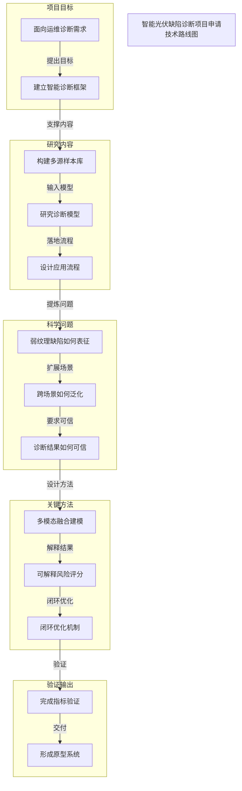

# 智能光伏缺陷诊断项目申请技术路线图

中文项目申请示例：研究内容、科学问题、关键方法与验证输出

## Route Evidence

| Stage | Node | Evidence |
|---|---|---|
| 项目目标 | 面向运维诊断需求 | source - examples/chinese-grant-application-demo/brief.md |
| 项目目标 | 建立智能诊断框架 | source - examples/chinese-grant-application-demo/brief.md |
| 研究内容 | 构建多源样本库 | source - examples/chinese-grant-application-demo/brief.md |
| 研究内容 | 研究诊断模型 | source - examples/chinese-grant-application-demo/brief.md |
| 研究内容 | 设计应用流程 | source - examples/chinese-grant-application-demo/brief.md |
| 科学问题 | 弱纹理缺陷如何表征 | source - examples/chinese-grant-application-demo/brief.md |
| 科学问题 | 跨场景如何泛化 | source - examples/chinese-grant-application-demo/brief.md |
| 科学问题 | 诊断结果如何可信 | source - examples/chinese-grant-application-demo/brief.md |
| 关键方法 | 多模态融合建模 | source - examples/chinese-grant-application-demo/brief.md |
| 关键方法 | 可解释风险评分 | source - examples/chinese-grant-application-demo/brief.md |
| 关键方法 | 闭环优化机制 | source - examples/chinese-grant-application-demo/brief.md |
| 验证输出 | 完成指标验证 | source - examples/chinese-grant-application-demo/brief.md |
| 验证输出 | 形成原型系统 | source - examples/chinese-grant-application-demo/brief.md |
