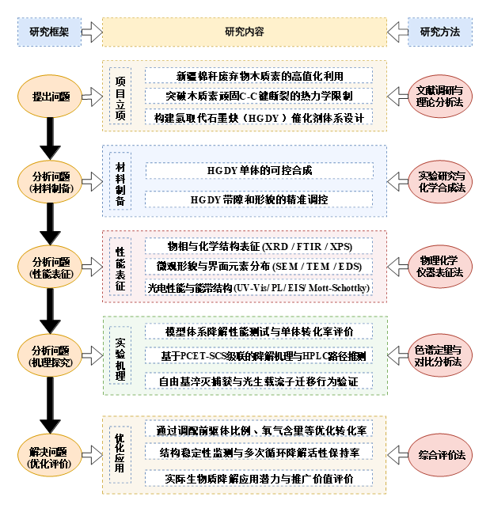

# Draw.io Copy-Code Demo

This demo shows the `drawio-code` output format. It is based on a Chinese HGDY photocatalytic lignin degradation technical-route reference image and demonstrates how a route can be delivered as copyable Draw.io XML.

Reference preview:

## Files

| File | Purpose |
|---|---|
| `source/hgdy-route-reference-cropped.png` | Cropped user-provided reference image for this demo. |
| `outputs/tech-route.json` | Structured route source. |
| `outputs/tech-route.drawio` | Editable Draw.io file. |
| `outputs/tech-route.drawio-code.xml` | Copyable Draw.io XML code. |
| `outputs/tech-route.svg` | Vector preview. |
| `outputs/tech-route.pptx` | Editable PowerPoint version. |

## Paste Into Draw.io

1. Open [diagrams.net / draw.io](https://app.diagrams.net/).
2. Create a blank diagram.
3. Open `outputs/tech-route.drawio-code.xml` and copy all XML text.
4. In diagrams.net, use **Extras > Edit Diagram**.
5. Replace the XML with the copied code and confirm.
6. Edit boxes, arrows, colors and text directly in Draw.io.

If the menu label differs by language, look for the command that edits or inserts diagram XML. The generated XML is the same editable Draw.io model used by `outputs/tech-route.drawio`.
