# HGDY光催化降解木质素技术路线图

Draw.io复制代码示例：从技术路线图参考图生成可编辑Draw.io XML

```mermaid
flowchart LR
  title["HGDY光催化降解木质素技术路线图"]
  subgraph proposal["项目立项"]
    proposal_value["棉秆木质素高值化利用"]
    proposal_cc["突破C-C键断裂限制"]
    proposal_hgdy["构建HGDY催化体系"]
  end
  subgraph material["材料制备"]
    material_synthesis["HGDY单体可控合成"]
    material_tuning["带隙和形貌精准调控"]
  end
  subgraph characterization["性能表征"]
    characterization_phase["物相与化学结构表征"]
    characterization_micro["形貌与元素分布"]
    characterization_photo["光电性能与能带结构"]
  end
  subgraph mechanism["实验机理"]
    mechanism_activity["降解性能与转化率评价"]
    mechanism_hplc["HPLC路径推测"]
    mechanism_radical["自由基与载流子验证"]
  end
  subgraph application["优化应用"]
    application_conversion["优化转化率条件"]
    application_stability["循环稳定性监测"]
    application_value["应用潜力与推广评价"]
  end
  proposal_value -->|提出关键限制| proposal_cc
  proposal_cc -->|设计催化体系| proposal_hgdy
  proposal_hgdy -->|进入制备| material_synthesis
  material_synthesis -->|调控结构| material_tuning
  material_tuning -->|表征物相| characterization_phase
  characterization_phase -->|观察形貌| characterization_micro
  characterization_micro -->|评估光电| characterization_photo
  characterization_photo -->|测试性能| mechanism_activity
  mechanism_activity -->|推测路径| mechanism_hplc
  mechanism_hplc -->|验证机理| mechanism_radical
  mechanism_radical -->|优化条件| application_conversion
  application_conversion -->|评估稳定| application_stability
  application_stability -->|形成应用评价| application_value
```

## Route Evidence

| Stage | Node | Evidence |
|---|---|---|
| 项目立项 | 棉秆木质素高值化利用 | source - examples/drawio-copy-code-demo/source/hgdy-route-reference-cropped.png |
| 项目立项 | 突破C-C键断裂限制 | source - examples/drawio-copy-code-demo/source/hgdy-route-reference-cropped.png |
| 项目立项 | 构建HGDY催化体系 | source - examples/drawio-copy-code-demo/source/hgdy-route-reference-cropped.png |
| 材料制备 | HGDY单体可控合成 | source - examples/drawio-copy-code-demo/source/hgdy-route-reference-cropped.png |
| 材料制备 | 带隙和形貌精准调控 | source - examples/drawio-copy-code-demo/source/hgdy-route-reference-cropped.png |
| 性能表征 | 物相与化学结构表征 | source - examples/drawio-copy-code-demo/source/hgdy-route-reference-cropped.png |
| 性能表征 | 形貌与元素分布 | source - examples/drawio-copy-code-demo/source/hgdy-route-reference-cropped.png |
| 性能表征 | 光电性能与能带结构 | source - examples/drawio-copy-code-demo/source/hgdy-route-reference-cropped.png |
| 实验机理 | 降解性能与转化率评价 | source - examples/drawio-copy-code-demo/source/hgdy-route-reference-cropped.png |
| 实验机理 | HPLC路径推测 | source - examples/drawio-copy-code-demo/source/hgdy-route-reference-cropped.png |
| 实验机理 | 自由基与载流子验证 | source - examples/drawio-copy-code-demo/source/hgdy-route-reference-cropped.png |
| 优化应用 | 优化转化率条件 | source - examples/drawio-copy-code-demo/source/hgdy-route-reference-cropped.png |
| 优化应用 | 循环稳定性监测 | source - examples/drawio-copy-code-demo/source/hgdy-route-reference-cropped.png |
| 优化应用 | 应用潜力与推广评价 | source - examples/drawio-copy-code-demo/source/hgdy-route-reference-cropped.png |
