# Campus Integrated Energy System Technical Route

Source-grid-load-storage engineering route generated by tech-route-maker

```mermaid
flowchart LR
  title["Campus Integrated Energy System Technical Route"]
  subgraph boundary["System Boundary"]
    boundary_scope["Define campus boundary"]
    boundary_targets["Set planning targets"]
  end
  subgraph data["Source Load Data"]
    data_load["Profile electric thermal load"]
    data_resource["Assess renewable resources"]
    data_tariff["Collect tariff constraints"]
  end
  subgraph model["Configuration Model"]
    model_assets["Model candidate assets"]
    model_objective["Optimize multi-objective sizing"]
    model_scenarios["Compare planning scenarios"]
  end
  subgraph operation["Operation Strategy"]
    operation_dispatch["Build dispatch strategy"]
    operation_control["Define control hierarchy"]
  end
  subgraph validation["Validation Output"]
    validation_kpi["Evaluate system KPIs"]
    validation_sensitivity["Run sensitivity checks"]
    validation_deliver["Deliver configuration plan"]
  end
  boundary_scope -->|sets| boundary_targets
  boundary_targets -->|requires| data_load
  data_load -->|combines| data_resource
  data_resource -->|constrains| data_tariff
  data_tariff -->|feeds| model_assets
  model_assets -->|optimizes| model_objective
  model_objective -->|compares| model_scenarios
  model_scenarios -->|selects| operation_dispatch
  operation_dispatch -->|organizes| operation_control
  operation_control -->|validates| validation_kpi
  validation_kpi -->|stress tests| validation_sensitivity
  validation_sensitivity -->|delivers| validation_deliver
```

## Route Evidence

| Stage | Node | Evidence |
|---|---|---|
| System Boundary | Define campus boundary | source - examples/engineering-energy-system-demo/brief.md |
| System Boundary | Set planning targets | source - examples/engineering-energy-system-demo/brief.md |
| Source Load Data | Profile electric thermal load | source - examples/engineering-energy-system-demo/brief.md |
| Source Load Data | Assess renewable resources | source - examples/engineering-energy-system-demo/brief.md |
| Source Load Data | Collect tariff constraints | source - examples/engineering-energy-system-demo/brief.md |
| Configuration Model | Model candidate assets | source - examples/engineering-energy-system-demo/brief.md |
| Configuration Model | Optimize multi-objective sizing | source - examples/engineering-energy-system-demo/brief.md |
| Configuration Model | Compare planning scenarios | source - examples/engineering-energy-system-demo/brief.md |
| Operation Strategy | Build dispatch strategy | source - examples/engineering-energy-system-demo/brief.md |
| Operation Strategy | Define control hierarchy | source - examples/engineering-energy-system-demo/brief.md |
| Validation Output | Evaluate system KPIs | source - examples/engineering-energy-system-demo/brief.md |
| Validation Output | Run sensitivity checks | source - examples/engineering-energy-system-demo/brief.md |
| Validation Output | Deliver configuration plan | source - examples/engineering-energy-system-demo/brief.md |
