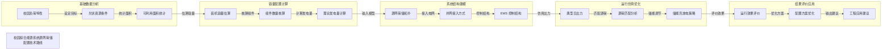

# 校园综合能源系统源网荷储配置技术路线

基于资源评估、容量测算、系统建模、仿真优化与结果评价的研究流程

```mermaid
flowchart LR
  title["校园综合能源系统源网荷储配置技术路线"]
  subgraph boundary["基础数据分析"]
    boundary_scope["校园负荷特性"]
    boundary_targets["光伏资源条件"]
    boundary_area["可利用面积统计"]
  end
  subgraph data["容量配置计算"]
    data_load["装机容量估算"]
    data_resource["组件数量核算"]
    data_tariff["理论发电量计算"]
  end
  subgraph model["系统结构建模"]
    model_assets["源网荷储拓扑"]
    model_objective["并网接入方式"]
    model_scenarios["EMS 控制结构"]
  end
  subgraph operation["运行仿真优化"]
    operation_dispatch["典型日出力"]
    operation_control["源荷匹配分析"]
    operation_storage["储能充放电策略"]
  end
  subgraph validation["结果评价应用"]
    validation_kpi["运行效果评价"]
    validation_sensitivity["配置方案优化"]
    validation_deliver["工程应用建议"]
  end
  boundary_scope -->|设定目标| boundary_targets
  boundary_targets -->|统计面积| boundary_area
  boundary_area -->|估算容量| data_load
  data_load -->|核算组件| data_resource
  data_resource -->|计算发电量| data_tariff
  data_tariff -->|输入模型| model_assets
  model_assets -->|接入电网| model_objective
  model_objective -->|控制结构| model_scenarios
  model_scenarios -->|仿真出力| operation_dispatch
  operation_dispatch -->|匹配源荷| operation_control
  operation_control -->|储能调节| operation_storage
  operation_storage -->|评价效果| validation_kpi
  validation_kpi -->|优化方案| validation_sensitivity
  validation_sensitivity -->|输出建议| validation_deliver
```

## Route Evidence

| Stage | Node | Evidence |
|---|---|---|
| 基础数据分析 | 校园负荷特性 | source - examples/engineering-energy-system-demo/brief.md |
| 基础数据分析 | 光伏资源条件 | source - examples/engineering-energy-system-demo/brief.md |
| 基础数据分析 | 可利用面积统计 | source - examples/engineering-energy-system-demo/brief.md |
| 容量配置计算 | 装机容量估算 | source - examples/engineering-energy-system-demo/brief.md |
| 容量配置计算 | 组件数量核算 | source - examples/engineering-energy-system-demo/brief.md |
| 容量配置计算 | 理论发电量计算 | source - examples/engineering-energy-system-demo/brief.md |
| 系统结构建模 | 源网荷储拓扑 | source - examples/engineering-energy-system-demo/brief.md |
| 系统结构建模 | 并网接入方式 | source - examples/engineering-energy-system-demo/brief.md |
| 系统结构建模 | EMS 控制结构 | source - examples/engineering-energy-system-demo/brief.md |
| 运行仿真优化 | 典型日出力 | source - examples/engineering-energy-system-demo/brief.md |
| 运行仿真优化 | 源荷匹配分析 | source - examples/engineering-energy-system-demo/brief.md |
| 运行仿真优化 | 储能充放电策略 | source - examples/engineering-energy-system-demo/brief.md |
| 结果评价应用 | 运行效果评价 | source - examples/engineering-energy-system-demo/brief.md |
| 结果评价应用 | 配置方案优化 | source - examples/engineering-energy-system-demo/brief.md |
| 结果评价应用 | 工程应用建议 | source - examples/engineering-energy-system-demo/brief.md |
