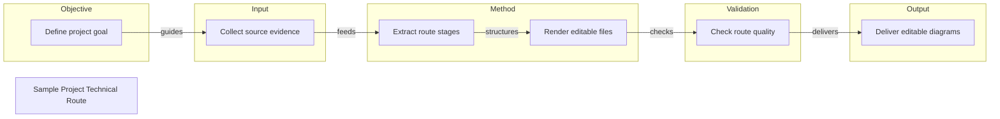

# Sample Project Technical Route

Editable route diagram generated from structured evidence

## Route Evidence

| Stage | Node | Evidence |
|---|---|---|
| Objective | Define project goal | file - README.md - Project overview |
| Input | Collect source evidence | file - docs/ - Project documentation |
| Method | Extract route stages | inference - Derived from repository scan pattern |
| Method | Render editable files | file - scripts/ - Renderer scripts |
| Validation | Check route quality | file - scripts/validate_route.py - Validation script |
| Output | Deliver editable diagrams | file - outputs/ - Selected output files |
