# Software Architecture Technical Route

Document-to-report workflow demo

```mermaid
flowchart LR
  title["Software Architecture Technical Route"]
  subgraph inputs["Inputs"]
    inputs_files["Receive user files"]
  end
  subgraph ingestion["Ingestion"]
    ingestion_service["Run ingestion service"]
    ingestion_store["Normalize data store"]
  end
  subgraph analysis["Analysis"]
    analysis_engine["Run analysis engine"]
    analysis_provenance["Track provenance"]
  end
  subgraph rendering["Rendering"]
    render_reports["Render reports"]
    render_registry["Register artifacts"]
  end
  subgraph quality["Quality Gate"]
    quality_rules["Apply validation rules"]
    quality_ci["Publish through CI"]
  end
  inputs_files -->|uploads| ingestion_service
  ingestion_service -->|normalizes| ingestion_store
  ingestion_store -->|feeds| analysis_engine
  analysis_engine -->|links| analysis_provenance
  analysis_provenance -->|annotates| render_reports
  render_reports -->|records| render_registry
  render_registry -->|checks| quality_rules
  quality_rules -->|releases| quality_ci
```

## Route Evidence

| Stage | Node | Evidence |
|---|---|---|
| Inputs | Receive user files | document - examples/software-architecture-demo/source/project-brief.md - Inputs |
| Ingestion | Run ingestion service | document - examples/software-architecture-demo/source/project-brief.md - Ingestion service and parser workers |
| Ingestion | Normalize data store | document - examples/software-architecture-demo/source/project-brief.md - Normalized data store |
| Analysis | Run analysis engine | document - examples/software-architecture-demo/source/project-brief.md - Analysis engine |
| Analysis | Track provenance | document - examples/software-architecture-demo/source/project-brief.md - Provenance tracking |
| Rendering | Render reports | document - examples/software-architecture-demo/source/project-brief.md - Output artifacts |
| Rendering | Register artifacts | document - examples/software-architecture-demo/source/project-brief.md - Artifact registry |
| Quality Gate | Apply validation rules | document - examples/software-architecture-demo/source/project-brief.md - Quality controls |
| Quality Gate | Publish through CI | document - examples/software-architecture-demo/source/project-brief.md - Deployment |
