# PV Module Degradation Assessment Technical Route

Thesis proposal route generated by tech-route-maker

```mermaid
flowchart LR
  title["PV Module Degradation Assessment Technical Route"]
  subgraph objective["Research Objective"]
    objective_problem["Define degradation risk"]
    objective_scope["Set evaluation scope"]
  end
  subgraph content["Research Content"]
    content_collect["Collect field evidence"]
    content_clean["Clean and align records"]
    content_indicators["Construct indicators"]
  end
  subgraph technology["Key Technologies"]
    technology_select["Select feature groups"]
    technology_model["Fit risk model"]
    technology_uncertainty["Estimate uncertainty"]
  end
  subgraph validation["Experimental Validation"]
    validation_cases["Validate fault cases"]
    validation_ablation["Review feature ablation"]
  end
  subgraph output["Expected Outputs"]
    output_priority["Output inspection priority"]
    output_thesis["Support thesis chapters"]
  end
  objective_problem -->|scopes| objective_scope
  objective_scope -->|requires evidence| content_collect
  content_collect -->|prepares| content_clean
  content_clean -->|constructs| content_indicators
  content_indicators -->|filters| technology_select
  technology_select -->|trains| technology_model
  technology_model -->|qualifies| technology_uncertainty
  technology_uncertainty -->|tests| validation_cases
  validation_cases -->|checks| validation_ablation
  validation_ablation -->|supports| output_priority
  output_priority -->|writes| output_thesis
```

## Route Evidence

| Stage | Node | Evidence |
|---|---|---|
| Research Objective | Define degradation risk | document - examples/thesis-proposal-demo/source/project-brief.md - Research problem |
| Research Objective | Set evaluation scope | document - examples/thesis-proposal-demo/source/project-brief.md - Scope |
| Research Content | Collect field evidence | document - examples/thesis-proposal-demo/source/project-brief.md - Inputs |
| Research Content | Clean and align records | document - examples/thesis-proposal-demo/source/project-brief.md - Data preparation |
| Research Content | Construct indicators | document - examples/thesis-proposal-demo/source/project-brief.md - Indicator construction |
| Key Technologies | Select feature groups | document - examples/thesis-proposal-demo/source/project-brief.md - Feature selection |
| Key Technologies | Fit risk model | document - examples/thesis-proposal-demo/source/project-brief.md - Risk model |
| Key Technologies | Estimate uncertainty | document - examples/thesis-proposal-demo/source/project-brief.md - Uncertainty labeling |
| Experimental Validation | Validate fault cases | document - examples/thesis-proposal-demo/source/project-brief.md - Historical cases |
| Experimental Validation | Review feature ablation | document - examples/thesis-proposal-demo/source/project-brief.md - Ablation and expert review |
| Expected Outputs | Output inspection priority | document - examples/thesis-proposal-demo/source/project-brief.md - Output |
| Expected Outputs | Support thesis chapters | document - examples/thesis-proposal-demo/source/project-brief.md - Thesis structure |
