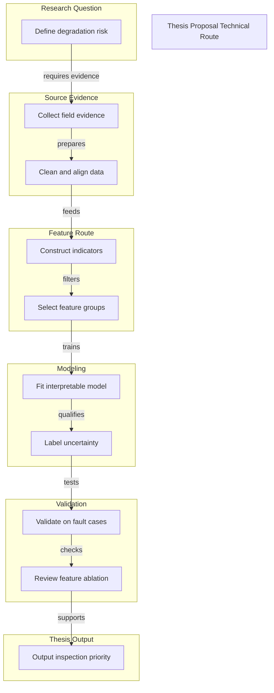

# Thesis Proposal Technical Route

Data-driven PV module degradation assessment demo

## Route Evidence

| Stage | Node | Evidence |
|---|---|---|
| Research Question | Define degradation risk | document - examples/thesis-proposal-demo/source/project-brief.md - Research question |
| Source Evidence | Collect field evidence | document - examples/thesis-proposal-demo/source/project-brief.md - Inputs |
| Source Evidence | Clean and align data | document - examples/thesis-proposal-demo/source/project-brief.md - Preparation |
| Feature Route | Construct indicators | document - examples/thesis-proposal-demo/source/project-brief.md - Feature construction |
| Feature Route | Select feature groups | document - examples/thesis-proposal-demo/source/project-brief.md - Feature selection |
| Modeling | Fit interpretable model | document - examples/thesis-proposal-demo/source/project-brief.md - Interpretable model and risk scoring |
| Modeling | Label uncertainty | document - examples/thesis-proposal-demo/source/project-brief.md - Uncertainty labeling |
| Validation | Validate on fault cases | document - examples/thesis-proposal-demo/source/project-brief.md - Historical fault cases and cross-site comparison |
| Validation | Review feature ablation | document - examples/thesis-proposal-demo/source/project-brief.md - Ablation and expert review |
| Thesis Output | Output inspection priority | document - examples/thesis-proposal-demo/source/project-brief.md - Output |
