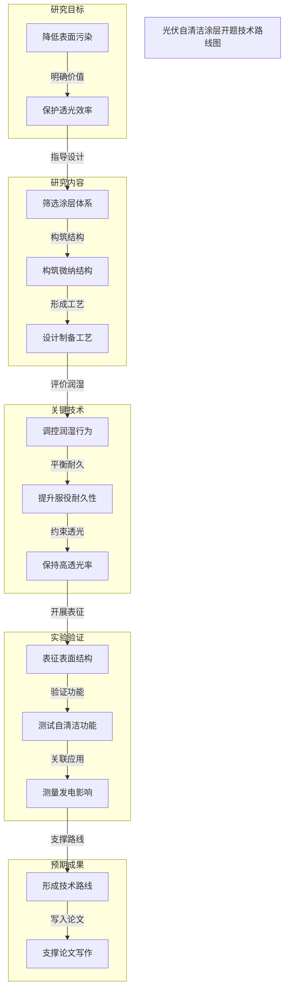

# 光伏自清洁涂层开题技术路线图

中文开题报告示例：材料设计、性能测试与光伏应用验证

```mermaid
flowchart TB
  title["光伏自清洁涂层开题技术路线图"]
  subgraph objective["研究目标"]
    objective_problem["降低表面污染"]
    objective_value["保护透光效率"]
  end
  subgraph content["研究内容"]
    content_material["筛选涂层体系"]
    content_texture["构筑微纳结构"]
    content_process["设计制备工艺"]
  end
  subgraph technology["关键技术"]
    technology_wetting["调控润湿行为"]
    technology_durability["提升服役耐久性"]
    technology_transparency["保持高透光率"]
  end
  subgraph validation["实验验证"]
    validation_surface["表征表面结构"]
    validation_cleaning["测试自清洁功能"]
    validation_power["测量发电影响"]
  end
  subgraph outcome["预期成果"]
    outcome_route["形成技术路线"]
    outcome_thesis["支撑论文写作"]
  end
  objective_problem -->|明确价值| objective_value
  objective_value -->|指导设计| content_material
  content_material -->|构筑结构| content_texture
  content_texture -->|形成工艺| content_process
  content_process -->|评价润湿| technology_wetting
  technology_wetting -->|平衡耐久| technology_durability
  technology_durability -->|约束透光| technology_transparency
  technology_transparency -->|开展表征| validation_surface
  validation_surface -->|验证功能| validation_cleaning
  validation_cleaning -->|关联应用| validation_power
  validation_power -->|支撑路线| outcome_route
  outcome_route -->|写入论文| outcome_thesis
```

## Route Evidence

| Stage | Node | Evidence |
|---|---|---|
| 研究目标 | 降低表面污染 | source - examples/thesis-proposal-demo/brief.md |
| 研究目标 | 保护透光效率 | source - examples/thesis-proposal-demo/brief.md |
| 研究内容 | 筛选涂层体系 | source - examples/thesis-proposal-demo/brief.md |
| 研究内容 | 构筑微纳结构 | source - examples/thesis-proposal-demo/brief.md |
| 研究内容 | 设计制备工艺 | source - examples/thesis-proposal-demo/brief.md |
| 关键技术 | 调控润湿行为 | source - examples/thesis-proposal-demo/brief.md |
| 关键技术 | 提升服役耐久性 | source - examples/thesis-proposal-demo/brief.md |
| 关键技术 | 保持高透光率 | source - examples/thesis-proposal-demo/brief.md |
| 实验验证 | 表征表面结构 | source - examples/thesis-proposal-demo/brief.md |
| 实验验证 | 测试自清洁功能 | source - examples/thesis-proposal-demo/brief.md |
| 实验验证 | 测量发电影响 | source - examples/thesis-proposal-demo/brief.md |
| 预期成果 | 形成技术路线 | source - examples/thesis-proposal-demo/brief.md |
| 预期成果 | 支撑论文写作 | source - examples/thesis-proposal-demo/brief.md |
